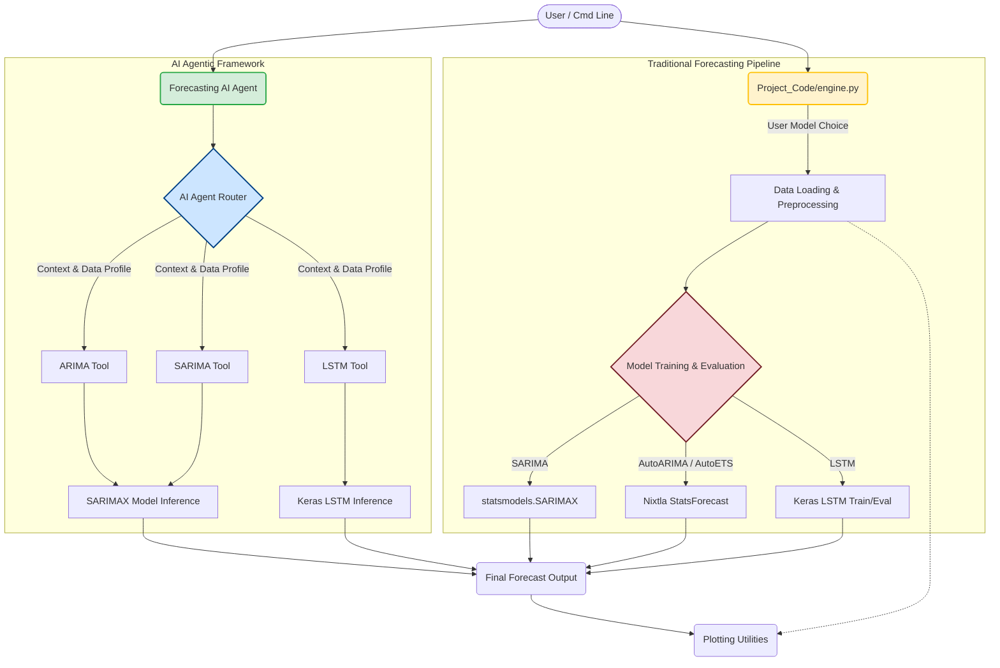

# Timeseries Forecasting using LSTM and AI Agents

This repository presents two distinct approaches to time series forecasting: a traditional, configurable model training pipeline and an autonomous AI agent capable of dynamically routing to the most suitable forecasting model (ARIMA, SARIMA, or LSTM) based on data characteristics and context.

## Badges


## ✨ Features

- **Autonomous AI Agent**: An intelligent agent that analyzes time series data characteristics (e.g., length, seasonality) and business context to automatically select the optimal forecasting model (ARIMA, SARIMA, LSTM).
- **SARIMA Implementation**: Robust Seasonal AutoRegressive Integrated Moving Average (SARIMA) model for capturing seasonality.
- **LSTM Deep Learning Model**: A powerful Long Short-Term Memory (LSTM) neural network for complex sequence prediction.
- **AutoARIMA & AutoETS Integration**: Utilizes Nixtla's `statsforecast` for automated ARIMA and ETS model selection and training, offering a streamlined approach to forecasting.
- **Data Preprocessing & Utility Functions**: Includes scripts for loading, cleaning, and visualizing time series data, as well as stationarity testing.
- **Modular Design**: Separates concerns into `agent.py`, `tools.py`, `utils.py`, `engine.py`, and `train.py` for clarity and maintainability.
- **Performance Metrics**: Calculates Mean Squared Error (MSE), Root Mean Squared Error (RMSE), and Mean Absolute Error (MAE) for model evaluation.

## 🏗️ Architecture

The project is structured into two main components: a traditional `Project_Code` for explicit model training and a `Forecasting_AI_Agent` for autonomous model selection.



## 💻 Tech Stack

- Python 3.9+
- `numpy`
- `pandas`
- `matplotlib`
- `seaborn`
- `statsmodels`
- `scikit-learn`
- `statsforecast` (for AutoARIMA, AutoETS)
- `tensorflow` (for LSTM)
- `pydantic`

## 📁 Project Structure

```
.
├── Forecasting_AI_Agent/
│   ├── agent.py               # Main AI agent orchestrator and router
│   ├── main.py                # Entry point for the AI agent
│   ├── tools.py               # Forecasting model implementations (ARIMA, SARIMA, LSTM for agent)
│   └── utils.py               # Utility functions for agent (e.g., data loading, plotting)
├── Project_Code/
│   ├── engine.py              # Main entry point for traditional model comparison
│   └── src/
│       ├── train.py           # Functions for training various forecasting models
│       └── utils.py           # Utility functions for traditional pipeline
├── requirements.txt           # Python dependencies
└── README.md
```

## 🚀 Getting Started

### Installation

1.  **Clone the repository:**
    ```bash
    git clone https://github.com/shreeg25/Timeseries_forecasting_using_LSTM.git
    cd Timeseries_forecasting_using_LSTM
    ```

2.  **Create a virtual environment (recommended):**
    ```bash
    python -m venv venv
    source venv/bin/activate  # On Windows: `venv\Scripts\activate`
    ```

3.  **Install dependencies:**
    ```bash
    pip install -r requirements.txt
    ```

4.  **Download the dataset:**
    This project uses the "International Airline Passengers" dataset. Please download `airline-passengers.csv` and place it in the root directory of the project for the `Forecasting_AI_Agent/main.py` script, or within a `Data/` folder for `Project_Code/engine.py`. A common source is Kaggle or UCI Machine Learning Repository.

### Running the AI Agent

To run the autonomous AI agent:

```bash
python Forecasting_AI_Agent/main.py
```
This script will load the `airline-passengers.csv` (ensure it's in the root), preprocess it, and then the AI agent will automatically select and run the appropriate forecasting model (ARIMA, SARIMA, or LSTM) based on its internal logic. It will then plot the forecast.

### Running the Traditional Forecasting Pipeline

To run a specific model from the `Project_Code` pipeline:

```bash
python Project_Code/engine.py --model [model_name] --data_path [path_to_csv] --test_size [float]
```

Replace `[model_name]` with one of `sarima`, `autoarima`, `autoets`, or `lstm`.
Replace `[path_to_csv]` with the path to your dataset (default is `Data/international-airline-passengers.csv`).
Replace `[float]` with the desired test set proportion (default is `0.2`).

**Examples:**

-   Run SARIMA model:
    ```bash
    python Project_Code/engine.py --model sarima --data_path Data/international-airline-passengers.csv
    ```
-   Run LSTM model with a larger test size:
    ```bash
    python Project_Code/engine.py --model lstm --test_size 0.3
    ```

## ⚙️ Configuration / Environment Variables

The project uses some environment variables internally, primarily for suppressing warnings or optimizing specific libraries. You generally won't need to configure these manually unless you encounter specific performance issues.

-   `OPENBLAS_CORETYPE`: Set to "Generic" to bypass hardware profiling for OpenBLAS (used by NumPy).
-   `NUMPY_EXPERIMENTAL_ARRAY_FUNCTION`: Set to "0".
-   `MKL_DEBUG_CPU_TYPE`: Set to "5".
-   `PANDAS_FUTURE_INFER_STRING_DTYPE`: Set to "0".
-   `CUDA_VISIBLE_DEVICES`: Set to `'-1'` in `Forecasting_AI_Agent/tools.py` to disable GPU for TensorFlow, forcing CPU usage.
-   `TF_CPP_MIN_LOG_LEVEL`: Set to `'3'` to suppress TensorFlow console output (INFO, WARNING, ERROR messages).
-   `NIXTLA_ID_AS_COL`: Set to `'1'` in `Project_Code/src/train.py` for Nixtla `statsforecast` library.

## 🤝 Contributing

Contributions are welcome! Please feel free to open issues or submit pull requests.

1.  Fork the repository.
2.  Create a new branch (`git checkout -b feature/your-feature-name`).
3.  Make your changes.
4.  Commit your changes (`git commit -m 'Add some feature'`).
5.  Push to the branch (`git push origin feature/your-feature-name`).
6.  Open a Pull Request.
